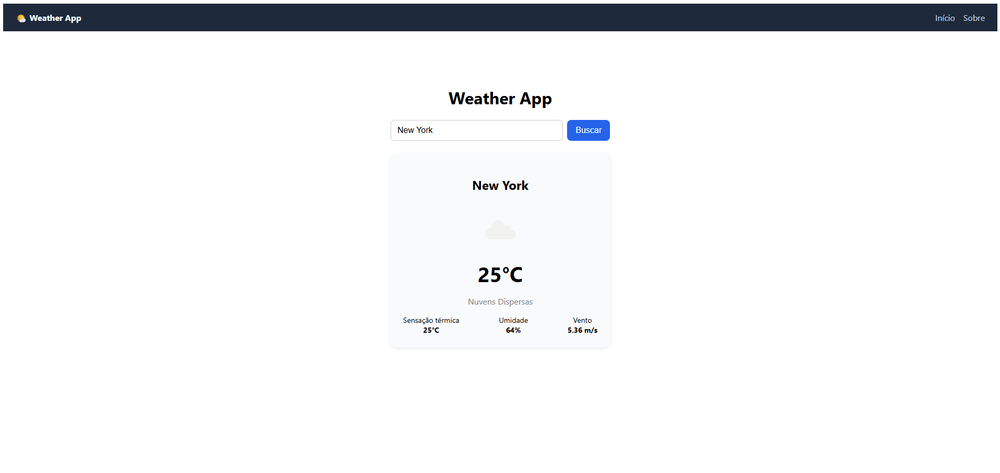

# 🌤️ Weather App

Aplicação simples de consulta de clima em tempo real, construída com React + Vite, consumindo a API pública do OpenWeatherMap.

## 🔗 Demo

[Acesse o projeto online](https://weather-app-beta-six-52.vercel.app)

## 🚀 Tecnologias

- React
- Vite
- React Router DOM
- OpenWeatherMap API
- CSS puro

## 🧠 O que este projeto demonstra

- Consumo de API externa com `fetch`
- Custom Hooks para separar lógica de estado da interface
- Componentização (Search, Card, Loading, Error, Navbar)
- Roteamento entre páginas com React Router (Home, Sobre, 404)
- Tratamento de erros (cidade não encontrada, falha de rede, campo vazio)
- Proteção de chaves de API com variáveis de ambiente
- Boas práticas de organização de pastas (components / pages / hooks / services)

## 📦 Como rodar localmente

\`\`\`bash
git clone https://github.com/GianWarmling/weather-app.git
cd weather-app
npm install
\`\`\`

Crie um arquivo \`.env\` na raiz baseado no \`.env.example\`:

\`\`\`
VITE_OPENWEATHER_API_KEY=sua_chave_aqui
\`\`\`

Você pode obter uma chave gratuita em [openweathermap.org/api](https://openweathermap.org/api).

\`\`\`bash
npm run dev
\`\`\`

## 📄 Licença

Este projeto está sob a licença MIT.